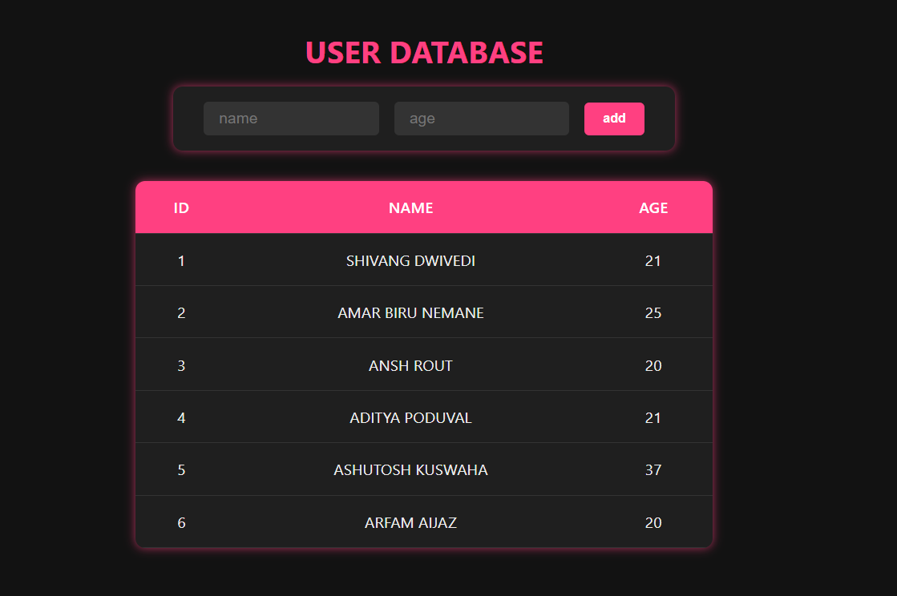

---

# Flask + PostgreSQL Docker Project

This project is a simple Flask app that connects to a PostgreSQL database running in Docker Container, means you dont have to install postgres on your system



It allows you to add users with name and age, and displays them in a neat UI.

---

## Prerequisites

* Docker installed on your machine
* Python 3.x installed
* Required python packages: `flask`, `psycopg2`

---

## Step 1: Pull and Run PostgreSQL Docker Container

Open your terminal/command prompt and run these commands in order:

1. Pull the postgres image:

```
   docker pull postgres
```

2. Run the container:

```
   docker run --name pgtest -e POSTGRES\_PASSWORD=pass123 -e POSTGRES\_DB=mydb -p 5432:5432 -d postgres
```

3. Check if the container is running:

```
   docker ps
```

You should see the container named **pgtest** running and listening on port 5432.

---

## Step 2: Install Python Dependencies

If you haven't already, install the required Python packages:

```
pip install flask psycopg2
```

---

## Step 3: Run the Flask Application

Make sure your `main.py` (Flask app code) is ready in your working directory.
Then run:

```
python main.py
```

The Flask app will start in debug mode and listen on [http://127.0.0.1:5000](http://127.0.0.1:5000)

---

## Step 4: Use the App

* Open your browser and go to [http://localhost:5000](http://localhost:5000)
* Add users by entering name and age
* See the user list update in the table below the form

---

## Notes

* The `users` table is auto-created if it does not exist on every app start.
* Database connection details are in `main.py` (host, port, user, password, dbname). Adjust if needed.

---

Enjoy your app and hit me up if you want to add more features! 🔥

---

*Created by Shivang*

---
